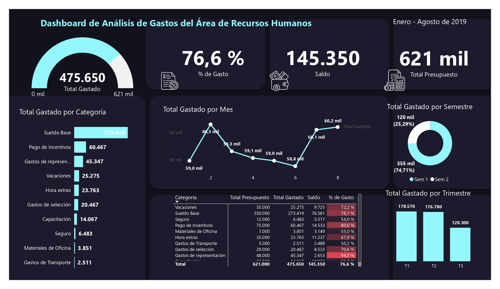

# Human Resources Expense Analysis Dashboard (Power BI)

## Overview

This project presents a **Power BI dashboard designed to analyze and optimize spending in a Human Resources (HR) department**.
It helps identify cost-reduction opportunities, monitor budget allocation, evaluate spending behavior over time, and support data-driven decision-making.

The dashboard includes key financial indicators (*KPIs*) and multiple visualizations that show how HR resources are being used across categories, months, quarters, and semesters.
The dataset and dashboard labels remain in **Spanish** because the original data source is in Spanish.

---

## Project Structure

```
/data
    Base de Datos.xlsx
/assets
    preview.jpg
/reports
    HR_Expense_Dashboard.pbix
README.md
```

---

## Dashboard Features

### **Key Measures (DAX)**

* **Total Gastado** – Total amount spent
* **Total Presupuesto** – Total yearly budget
* **Saldo** – Remaining budget
* **Porcentaje de Gasto** – Percentage of budget consumed

### **Visualizations Included**

* **Gauge chart** – Total spent
* **Cards / KPIs** – Budget, remaining balance, spending percentage
* **Bar chart** – Total spent by category
* **Line chart** – Total spent by month
* **Matrix** – Category, budget, total spent, balance, and percentage of spending
* **Donut chart** – Total spent by semester
* **Column chart** – Total spent by quarter

These visuals provide a complete view of how resources are used throughout the year and help uncover patterns and areas for improvement.

---

## Insights & Use Cases

This dashboard is useful for:

* **HR managers** who need to track operational spending
* **Financial directors** evaluating budget efficiency
* **Operations managers** optimizing resource allocation
* **Consultants and small businesses** seeking better expense control

It can help:

* Identify areas where costs can be reduced
* Improve budgeting and planning processes
* Monitor spending across categories and time periods
* Make decisions backed by clear, accessible data
* Increase operational efficiency and productivity

---

## Dataset Information

The dataset consists of three tables provided in Excel:

### **1. Presupuesto (Budget)**

* Cuenta
* Categoría
* Presupuesto anual

### **2. Gastos (Expenses)**

* Fecha
* Cuenta
* Gastos

### **3. Calendario (Calendar)**

* Fecha
* Año
* Mes
* Trimestre
* Semestre
* Semana
* Día
* Número de día
* Número de semana
* Nombre del día

---

## Tools & Technologies Used

* **Power BI Desktop**
* **Power Query** (ETL)
* **DAX** (Calculations and KPIs)
* **Excel** (Data structure and input files)

---

## How to Use This Repository

1. Clone or download the repository.
2. Open the file `HR_Expense_Dashboard.pbix` located in the `reports/` folder.
3. Ensure the Excel files inside `/data` maintain the same names and structure.
4. Refresh the data if necessary.

---

## Dashboard Preview

A preview image is available inside the `/assets` folder.



---

## About the Author

**Emily Alvarado Bolívar**

* Aspiring Data Analyst
* Background in Software Engineering
* Skills in Python, SQL, Excel, and Power BI
* Focused on data visualization and business analytics

---

